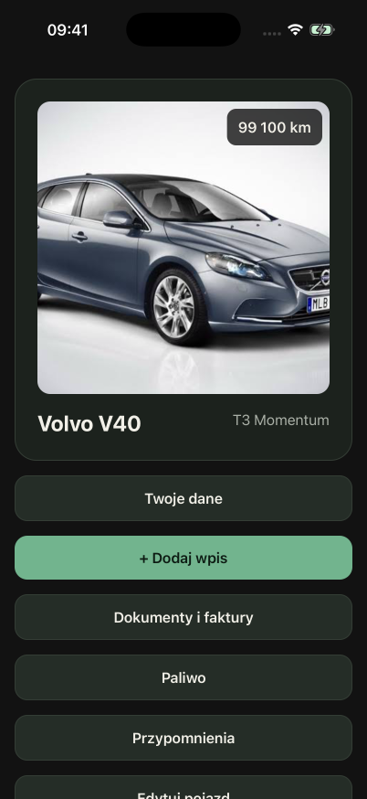
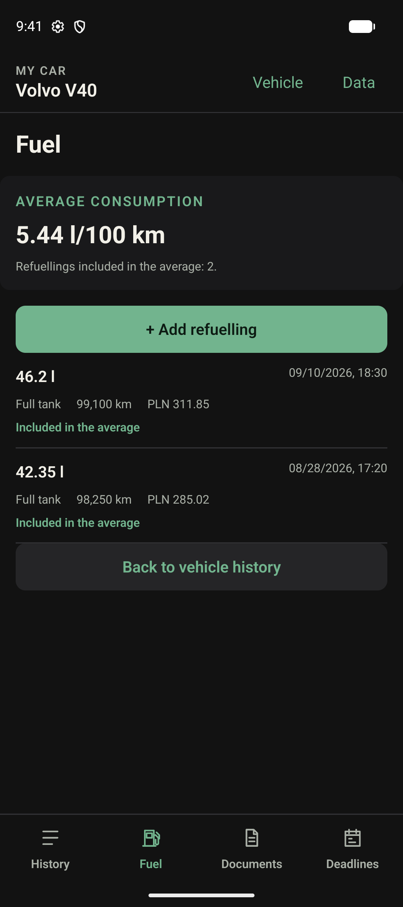
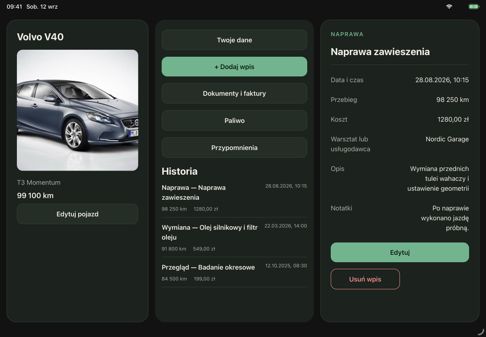
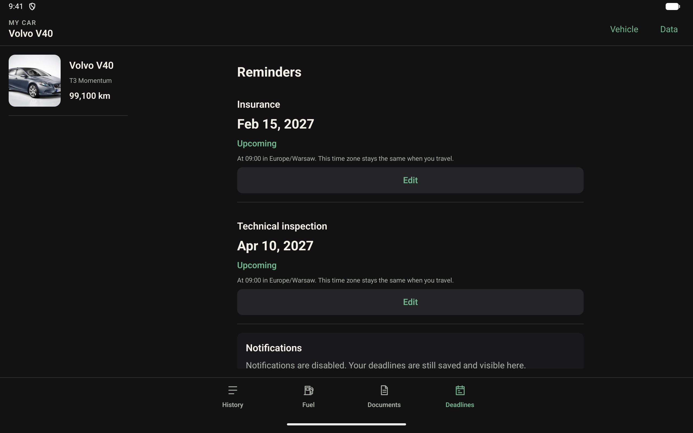

# Moje Auto

## Twój samochód. Cała historia. Jedno miejsce.

Moje Auto pomaga uporządkować najważniejsze informacje o samochodzie bez konta,
chmury i zbędnych formalności. Historia serwisowa, koszty, tankowania, dokumenty
oraz nadchodzące terminy są zawsze pod ręką i pozostają zapisane lokalnie na
urządzeniu.

### Samochód w skrócie

Zdjęcie, aktualny przebieg i najważniejsze dane pojazdu tworzą przejrzysty punkt
startowy. Z tego miejsca można szybko dodać kolejny wpis, sprawdzić dokumenty,
tankowania lub przypomnienia.

### Kontrola kosztów i zużycia paliwa

Każde tankowanie buduje czytelną historię kosztów. Aplikacja automatycznie oblicza
średnie zużycie paliwa na podstawie pełnych tankowań i przebiegu pojazdu.

### Historia, która ma znaczenie

Przeglądy, wymiany i naprawy można opisać wraz z datą, przebiegiem, kosztem,
warsztatem oraz dokumentami. Na tablecie historia i szczegóły wybranego wpisu są
widoczne jednocześnie.

### Ważne terminy bez niespodzianek

Moje Auto przechowuje terminy ubezpieczenia i badania technicznego oraz może
przypomnieć o nich z wyprzedzeniem. Układ dopasowuje się zarówno do telefonu, jak
i większego ekranu tabletu.

## Jedna aplikacja na wszystkie urządzenia

Moje Auto powstaje jako natywna aplikacja dla telefonów i tabletów z Androidem
oraz dla iPhone'a i iPada. Pierwsze bezpłatne wydanie obejmuje jeden samochód i
pełny zestaw funkcji potrzebnych do prowadzenia jego codziennej historii.

> Zrzuty pochodzą z natywnych buildów QA i przedstawiają dane demonstracyjne.
