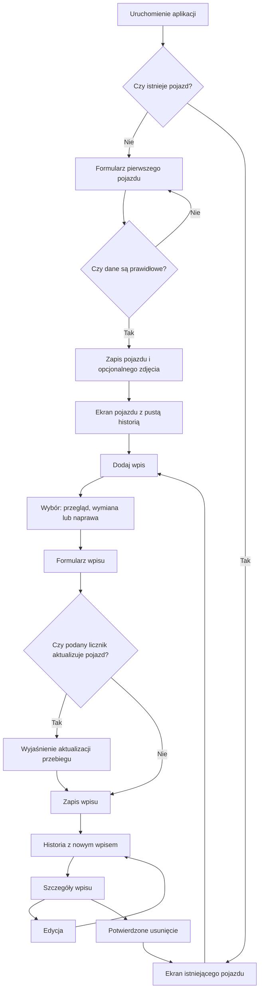

# Przepływ pierwszego pojazdu

## Status dokumentu

**Status:** zatwierdzony przepływ użytkownika

**Faza realizacji:** Faza 0 — decyzje produktowe i domenowe

**Status implementacji:** niezaimplementowany

Ten roboczy dokument opisuje pierwszy kompletny przepływ użytkownika: od uruchomienia aplikacji bez
danych do utworzenia pojazdu oraz zarządzania pierwszym wpisem jego historii. Wireframe’y pokazują
hierarchię informacji i zachowanie, a nie finalny wygląd interfejsu.

Model danych i reguły biznesowe wynikają z [modelu domenowego](./domain-model.md). Dokument nie
zmienia zatwierdzonych zasad licznika początkowego, aktualnego przebiegu, zdjęcia pojazdu, pieniędzy,
dat ani usuwania.

## Cel pierwszego przekroju

Po zakończeniu przepływu użytkownik potrafi bez połączenia z siecią:

1. Dodać jeden pojazd z wymaganymi danymi, opcjonalnym zdjęciem i licznikiem początkowym.
2. Rozpoznać swój pojazd i jego aktualny przebieg na głównym ekranie.
3. Dodać przegląd, wymianę albo naprawę z opcjonalnym bieżącym odczytem licznika.
4. Otworzyć szczegóły wpisu, edytować go i bezpiecznie usunąć.
5. Zamknąć aplikację i po ponownym uruchomieniu zobaczyć zachowane dane.

Poza tym przekrojem pozostają dokumenty, tankowania, przypomnienia, Premium, wiele pojazdów i
synchronizacja. Ich przyszłe miejsca w architekturze informacji nie mogą blokować pierwszego
użytecznego przepływu.

## Główny przebieg



## Uruchomienie i inicjalizacja

### Stan bez pojazdu

- Aplikacja otwiera lokalną bazę i wykonuje migracje przed pokazaniem edytowalnego interfejsu.
- Brak pojazdu prowadzi bezpośrednio do formularza pierwszego pojazdu.
- Nie ma slajdów marketingowych, obowiązkowego konta ani pytań o powiadomienia.
- Krótkie wprowadzenie nad formularzem wyjaśnia wartość: zapisanie historii, kosztów i przyszłych
  terminów w jednym miejscu.
- Cofnięcie lub zamknięcie aplikacji nie tworzy pustego rekordu pojazdu.

### Stan z pojazdem

- Aplikacja prowadzi bezpośrednio do ekranu pojazdu.
- Awaria inicjalizacji pokazuje stan błędu z możliwością ponowienia, bez sugerowania utraty danych.
- Migracja ani awaria pamięci nie mogą przekierować użytkownika do tworzenia nowego pojazdu, dopóki
  istnienie danych nie zostało bezpiecznie rozstrzygnięte.

## Dodawanie pierwszego pojazdu

Formularz jest jednym skupionym przepływem podzielonym na trzy grupy. Na telefonie może zajmować
jeden przewijany ekran; nie wymaga wieloetapowego kreatora. Wszystkie pola opcjonalne są domyślnie
widoczne, aby użytkownik od razu znał dostępny zakres danych.

### 1. Tożsamość

| Pole                | Zachowanie                                                    |
| ------------------- | ------------------------------------------------------------- |
| Marka               | Wymagane, klawiatura tekstowa, walidacja po opuszczeniu pola. |
| Model               | Wymagane, klawiatura tekstowa, walidacja po opuszczeniu pola. |
| Wersja              | Opcjonalna; w domenie przechowywana jako `variant`.           |
| Rok produkcji       | Opcjonalny, klawiatura numeryczna.                            |
| Numer rejestracyjny | Opcjonalny, zachowany w postaci wpisanej przez użytkownika.   |
| VIN                 | Opcjonalny, automatycznie normalizowany do wielkich liter.    |

### 2. Zdjęcie

- Użytkownik może wybrać najwyżej jedno zdjęcie.
- Pole jest opcjonalne i nigdy nie blokuje utworzenia pojazdu.
- Po wybraniu widoczny jest podgląd oraz akcje `Zmień` i `Usuń`.
- Nieudany import zachowuje wszystkie dane formularza i pozwala ponowić wybór albo kontynuować bez
  zdjęcia.

### 3. Stan licznika na moment rozpoczęcia ewidencji

| Pole                                          | Zachowanie                                                                |
| --------------------------------------------- | ------------------------------------------------------------------------- |
| Jednostka                                     | Wymagane `km` albo `mi`; domyślna wartość wynika z ustawień regionalnych. |
| Stan licznika na moment rozpoczęcia ewidencji | Opcjonalna nieujemna liczba całkowita.                                    |

Tekst pomocniczy wyjaśnia, że jest to odczyt z momentu rozpoczęcia ewidencji i że późniejsze odczyty
można wpisywać przy każdym zdarzeniu.

### Zapis

- Główna akcja ma etykietę `Dodaj pojazd`.
- Walidacja jest prezentowana przy odpowiednim polu, a pierwszy błąd otrzymuje fokus.
- Podczas zapisu akcja jest zablokowana przed wielokrotnym użyciem i pokazuje jednoznaczny stan
  oczekiwania.
- Po sukcesie użytkownik trafia na ekran pojazdu. Formularz nie pozostaje w historii nawigacji.
- Błąd zapisu pozostawia formularz i zdjęcie do ponowienia; nie powstaje częściowy pojazd.

## Ekran pojazdu

Ekran pojazdu jest główną przestrzenią pracy, nie dashboardem metryk.

Kolejność informacji:

1. Zdjęcie lub neutralny placeholder z aktualnym przebiegiem po prawej stronie.
2. Marka i model pod zdjęciem po lewej stronie oraz opcjonalna wersja w tym samym wierszu po prawej.
3. Jedna dominująca akcja `Dodaj wpis`.
4. Chronologiczna historia.
5. Drugorzędna akcja edycji danych pojazdu.

Jeśli wersja nie została podana, wiersz pod zdjęciem zawiera tylko markę i model, bez rezerwowania
pustego miejsca po prawej. Jeśli opcjonalna wartość nie istnieje, ekran pomija ją bez pustej
etykiety, odstępu lub placeholdera. Wyjątkiem jest aktualny przebieg: jego brak jest istotnym stanem
i może zostać zakomunikowany zwięzłym tekstem `Brak odczytu` po prawej stronie zdjęcia.

Przed wdrożeniem przypomnień ekran nie pokazuje pustych kart ubezpieczenia i przeglądu. Przed
dodaniem dokumentów, kosztów zbiorczych i tankowań nie tworzy dla nich atrap sekcji.

### Pusta historia

- Komunikat wyjaśnia, jakie zdarzenia można zapisać.
- Ta sama akcja `Dodaj pierwszy wpis` może pojawić się w stanie pustym, ale nie konkuruje z inną
  akcją główną.
- Nie są generowane przykładowe dane udające historię użytkownika.

### Historia z wpisami

- Wpisy są ułożone malejąco według daty zdarzenia.
- Wiersz pokazuje typ, główny przedmiot, datę oraz opcjonalnie przebieg i koszt.
- Brak kosztu lub przebiegu nie jest wyświetlany jako zero.
- Dotknięcie całego wiersza otwiera szczegóły.

## Dodawanie wpisu historii

### Wybór typu

Po użyciu `Dodaj wpis` użytkownik wybiera jeden z trzech jasno opisanych typów:

- `Przegląd` — obowiązkowe badanie, diagnostyka lub inna kontrola;
- `Wymiana` — część, płyn lub materiał eksploatacyjny;
- `Naprawa` — usunięcie usterki lub uszkodzenia.

Typ wybiera się przed pokazaniem pełnego formularza, aby formularz zawierał tylko potrzebne pola.
Po utworzeniu wpisu typ jest niezmienny.

### Pola wspólne

| Pole                 | Zachowanie                                                                                 |
| -------------------- | ------------------------------------------------------------------------------------------ |
| Data zdarzenia       | Wymagana, domyślnie dzisiaj, bez możliwości wyboru przyszłej daty.                         |
| Bieżący licznik      | Opcjonalny, w jednostce pojazdu.                                                           |
| Koszt całkowity      | Opcjonalny; zero i brak wartości pozostają rozróżnione.                                    |
| Waluta               | Pokazywana przy koszcie, domyślnie według ustawień regionalnych, zapisywana razem z kwotą. |
| Warsztat/usługodawca | Opcjonalny.                                                                                |
| Notatki              | Opcjonalne, wielowierszowe.                                                                |

### Pola zależne od typu

| Typ      | Pola                                                          |
| -------- | ------------------------------------------------------------- |
| Przegląd | Rodzaj, wynik oraz opcjonalny opis.                           |
| Wymiana  | Wymieniony element oraz opcjonalnie producent i numer części. |
| Naprawa  | Przedmiot naprawy oraz opcjonalny opis wykonanej pracy.       |

### Zachowanie licznika

- Brak odczytu nie blokuje zapisu wpisu.
- Pierwszy odczyt albo odczyt wyższy od aktualnego staje się nowym aktualnym przebiegiem pojazdu.
- Formularz pokazuje przy polu krótką informację `Aktualny przebieg pojazdu zostanie zaktualizowany`.
- Niższy odczyt jest dozwolony dla historii. Niespójność z sąsiednimi datami wywołuje ostrzeżenie,
  które użytkownik może świadomie zaakceptować.
- Zapis, który aktualizuje pojazd i tworzy wpis, jest jedną operacją z perspektywy użytkownika.
- Po pomyślnym zapisie użytkownik wraca do historii pojazdu, gdzie nowy wpis znajduje się we
  właściwym miejscu chronologicznym.

### Przerwanie i błędy

- Cofnięcie z wprowadzonymi danymi wymaga wyboru `Kontynuuj edycję` albo `Odrzuć zmiany`.
- Przejście aplikacji do tła nie czyści formularza.
- Błąd pamięci nie jest prezentowany jako błąd walidacji.
- Ponowienie po błędzie nie może utworzyć zduplikowanego wpisu.

## Szczegóły, edycja i usuwanie wpisu

### Szczegóły

- Nagłówek identyfikuje typ i główny przedmiot wpisu.
- Data, przebieg, koszt, usługodawca, szczegóły typu i notatki są pokazane w spokojnej liście.
- Nieobecne dane są pomijane zamiast wypełniane etykietą przy każdym polu.
- Główna akcja to `Edytuj`; `Usuń wpis` pozostaje działaniem destrukcyjnym o niższej ekspozycji.
- `Edytuj` zajmuje pełną dostępną szerokość. `Usuń wpis` znajduje się pod nim, ma połowę tej
  szerokości i jest wyrównane do lewej krawędzi. Pomiędzy przyciskami pozostaje wyraźny odstęp.

### Edycja

- Używa tego samego formularza co tworzenie, z nieedytowalnym typem.
- Zmiana na wyższy odczyt może podnieść aktualny przebieg pojazdu.
- Zmiana na niższy odczyt ani usunięcie odczytu nie obniżają automatycznie aktualnego przebiegu.
- Zapis zachowuje identyfikator i pierwotną datę utworzenia rekordu.

### Usuwanie

- Potwierdzenie identyfikuje wpis przez typ, przedmiot i datę.
- Dialog jasno mówi, że operacji nie można cofnąć.
- Akcja potwierdzająca ma konkretną etykietę `Usuń wpis`, a anulowanie jest domyślną bezpieczną
  ścieżką.
- Po sukcesie użytkownik wraca do ekranu pojazdu, a aktualny przebieg nie jest automatycznie obniżany.

## Nawigacja

Pierwszy przekrój nie wymaga budowania wszystkich czterech docelowych miejsc nawigacji. W Fazie 1
można uruchomić minimalną strukturę prowadzącą do `Pojazdu`, a `Paliwo`, `Przypomnienia` i
`Ustawienia` dodać wtedy, gdy ich pierwsze użyteczne powierzchnie będą implementowane.

Wireframe docelowego MVP może pokazywać kontekst czterech miejsc, ale nie wolno wydawać pustych kart
ani nieaktywnych atrap nawigacji jako gotowej funkcji.

## Wireframe telefonu

### Pierwszy pojazd

```text
┌──────────────────────────────┐
│ Moje Auto                    │
│                              │
│ Dodaj pierwszy pojazd        │
│ Historia auta w jednym miejscu│
│                              │
│ Marka *                      │
│ [__________________________] │
│ Model *                      │
│ [__________________________] │
│ Wersja                       │
│ [__________________________] │
│ Rok produkcji                │
│ [__________________________] │
│ Numer rejestracyjny          │
│ [__________________________] │
│ VIN                          │
│ [__________________________] │
│ [       Dodaj zdjęcie      ] │
│                              │
│ Stan licznika na moment      │
│ rozpoczęcia ewidencji        │
│ [____________] [ km ▾ ]      │
│                              │
│ [       Dodaj pojazd       ] │
└──────────────────────────────┘
```

Pola opcjonalne są od razu widoczne. Po zapisaniu pojazdu widoki odczytowe pokazują wyłącznie
wartości, które rzeczywiście istnieją, bez rezerwowania pustej przestrzeni.

### Ekran pojazdu

```text
┌──────────────────────────────┐
│                       Edytuj │
│ ┌──────────────────────────┐ │
│ │                84 320 km │ │
│ │      zdjęcie auta        │ │
│ └──────────────────────────┘ │
│ Volvo V60        B4 Momentum │
│                              │
│ [        + Dodaj wpis      ] │
│                              │
│ Historia                     │
│ ──────────────────────────── │
│ Brak wpisów                  │
│ Dodaj przegląd, wymianę      │
│ albo naprawę.                │
│                              │
│ [   Dodaj pierwszy wpis    ] │
└──────────────────────────────┘
```

Jeżeli wersja nie istnieje, pod zdjęciem pozostają tylko marka i model wyrównane do lewej. Przebieg
— jeśli istnieje — pozostaje po prawej stronie zdjęcia.

### Formularz wpisu

```text
┌──────────────────────────────┐
│ Anuluj      Dodaj wymianę    │
│                              │
│ Wymieniony element *         │
│ [ Olej silnikowy___________] │
│ Data *                       │
│ [ 29.08.2026______________] │
│ Bieżący licznik              │
│ [ 85 140______________] km   │
│ Aktualny przebieg zostanie   │
│ zaktualizowany.              │
│ Koszt                        │
│ [ 430,00___________] [PLN ▾] │
│ Warsztat                     │
│ [__________________________] │
│ Notatki                      │
│ [__________________________] │
│                              │
│ [          Zapisz          ] │
└──────────────────────────────┘
```

### Szczegóły wpisu

```text
┌──────────────────────────────┐
│ Wymiana                      │
│ Olej silnikowy               │
│ ──────────────────────────── │
│ Data              29.08.2026 │
│ Przebieg            85 140 km│
│ Koszt             430,00 PLN │
│ Warsztat          Auto Serwis│
│                              │
│ [          Edytuj          ] │
│                              │
│ [   Usuń wpis  ]             │
└──────────────────────────────┘
```

## Wireframe tabletu

Na iPadOS oraz tabletach z Androidem aplikacja wykorzystuje dynamiczny układ dwóch lub trzech kart.
Stała karta pojazdu znajduje się po lewej i zawiera kolejno markę z modelem, zdjęcie, opcjonalną
wersję oraz aktualny przebieg. Nie jest zastępowana przez historię, formularz ani szczegóły.

### Historia bez wybranego wpisu — dwie karty

```text
┌───────────────────────────────────────────────────────────────────────┐
│ Moje Auto                                                             │
├─────────────────────────┬─────────────────────────────────────────────┤
│ Volvo V60               │ [ + Dodaj wpis ]                           │
│ ┌─────────────────────┐ │                                             │
│ │    zdjęcie auta     │ │ Historia                                   │
│ └─────────────────────┘ │ ─────────────────────────────────────────── │
│ B4 Momentum             │ Wymiana oleju       29.08 · 430,00 PLN     │
│ 84 320 km               │ Przegląd techniczny 14.06 · zaliczony      │
└─────────────────────────┴─────────────────────────────────────────────┘
```

Przy braku wyboru nie istnieje pusta trzecia karta. Lista historii wykorzystuje całe pozostałe
miejsce i jest prawą kartą układu.

### Historia z wybranym wpisem — trzy karty

```text
┌───────────────────────────────────────────────────────────────────────┐
│ Moje Auto                                                             │
├───────────────────┬───────────────────────┬───────────────────────────┤
│ Volvo V60         │ [ + Dodaj wpis ]      │ Wymiana oleju             │
│ ┌───────────────┐ │ Historia              │ 29.08.2026 · 85 140 km   │
│ │ zdjęcie auta  │ │ ───────────────────── │                           │
│ └───────────────┘ │ Wymiana oleju         │ Koszt        430,00 PLN  │
│ B4 Momentum       │ Przegląd techniczny   │ Warsztat     Auto Serwis │
│ 84 320 km         │                       │                           │
│                   │                       │ [ Edytuj ]                │
└───────────────────┴───────────────────────┴───────────────────────────┘
```

Karta szczegółów pojawia się dopiero po wybraniu wpisu. Lista historii staje się kartą środkową,
ale pozostaje widoczna dla zachowania kontekstu.

### Dodawanie i edycja — dwie karty

- Sam wybór typu wpisu jest pokazywany w ogólnym widoku obok stałej karty pojazdu.
- Po przejściu do formularza historia znika. Karta pojazdu pozostaje po lewej, a formularz zajmuje
  około 60–75% szerokości po prawej.
- Po wybraniu `Edytuj` w szczegółach karta historii i karta szczegółów znikają, a ich miejsce zajmuje
  szeroki formularz edycji. Karta pojazdu pozostaje bez zmian.
- Po zapisaniu lub anulowaniu użytkownik wraca do historii; po zapisie żaden wpis nie musi pozostać
  automatycznie wybrany.
- Przy szerokości, która nie mieści czytelnie dwóch kart, tablet przechodzi do nawigacji ekranowej
  zamiast ściskać kolumny.

## Dostępność i lokalizacja

- Kolejność fokusu odpowiada kolejności wizualnej i znaczeniu pól.
- Etykiety nie znikają po wpisaniu wartości; placeholder nie zastępuje etykiety.
- Błędy są przekazywane tekstem i technologiom asystującym, nie tylko kolorem.
- Zdjęcie ma opis dostępności wynikający z pojazdu, a akcje zmiany i usuwania mają widoczne etykiety.
- Układ obsługuje duży tekst bez ucinania wymaganych etykiet i akcji.
- Kwoty, daty i liczby są formatowane zgodnie z locale, ale zapisane wartości domenowe pozostają
  niezmienione.
- Projekt zakłada dłuższe tłumaczenia i nie ustala szerokości przycisków na podstawie jednego języka.

## Kryteria akceptacji przepływu

1. Użytkownik rozumie bez instrukcji, które pola pojazdu są wymagane.
2. Może dodać pojazd bez zdjęcia i bez licznika początkowego.
3. Może dodać pojazd z jednym zdjęciem i licznikiem początkowym.
4. Po zapisie rozpoznaje pojazd, aktualny przebieg i główną akcję w kilka sekund.
5. Rozróżnia przegląd, wymianę i naprawę przed rozpoczęciem formularza.
6. Rozumie, kiedy odczyt wpisu zmieni aktualny przebieg pojazdu.
7. Może zapisać wpis bez kosztu i bez odczytu licznika.
8. Błąd albo przerwanie nie usuwa wprowadzonych danych bez decyzji użytkownika.
9. Po ponownym uruchomieniu pojazd, zdjęcie i wpis pozostają dostępne offline.
10. Usunięcie wymaga świadomego potwierdzenia i nie zmienia automatycznie aktualnego przebiegu.
11. Na iPadOS i tabletach z Androidem historia i szczegóły wykorzystują dodatkową szerokość zamiast
    powiększać układ telefonu.
12. Przepływ jest wykonalny z dużym tekstem, czytnikiem ekranu i bez rozróżniania elementów wyłącznie
    kolorem.

## Zatwierdzone decyzje UX

1. Wszystkie opcjonalne pola pojazdu są domyślnie widoczne w formularzu.
2. Widoki odczytowe pomijają nieuzupełnione pola bez pozostawiania pustej przestrzeni.
3. Typ wpisu jest wybierany na osobnej powierzchni przed pokazaniem właściwego formularza.
4. Szczegóły wpisu na telefonie pozostają osobnym, pełnym widokiem.
5. Po zapisaniu wpisu użytkownik wraca do historii pojazdu.
6. Tabletowy układ lista–szczegóły jest przeznaczony zarówno dla iPadOS, jak i Androida.
7. Bez wybranego wpisu tablet pokazuje dwie karty; szczegóły wyjeżdżają jako trzecia karta dopiero po
   wyborze wpisu.
8. Formularz dodawania i edycji zastępuje historię oraz szczegóły, zajmując 60–75% szerokości obok
   stałej karty pojazdu.
9. Domyślny wygląd aplikacji używa grafitowego tła `#121212` zamiast zupełnej czerni. Delikatnie
   jaśniejsze powierzchnie kart i pól zachowują czytelną hierarchię.
