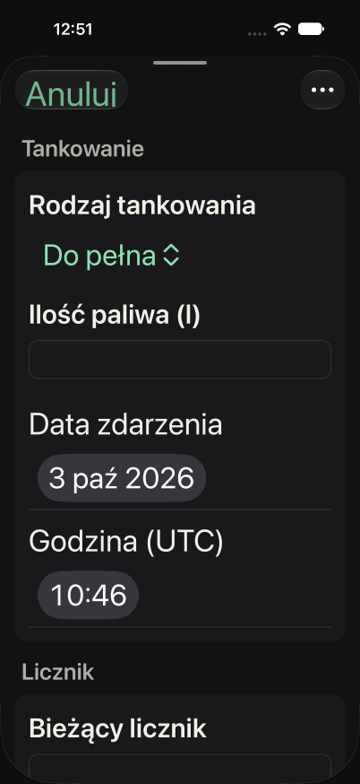
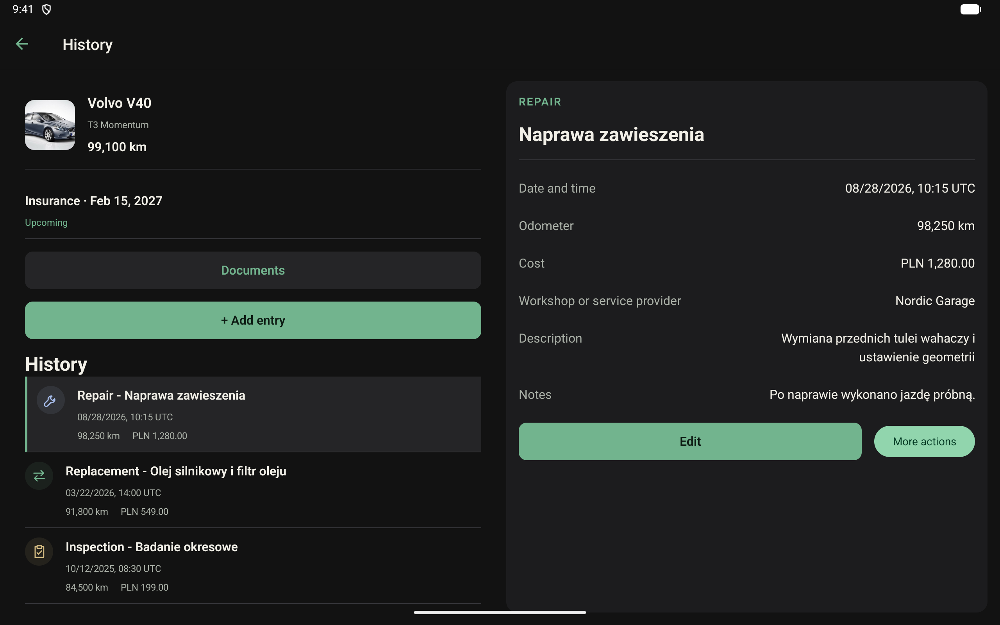
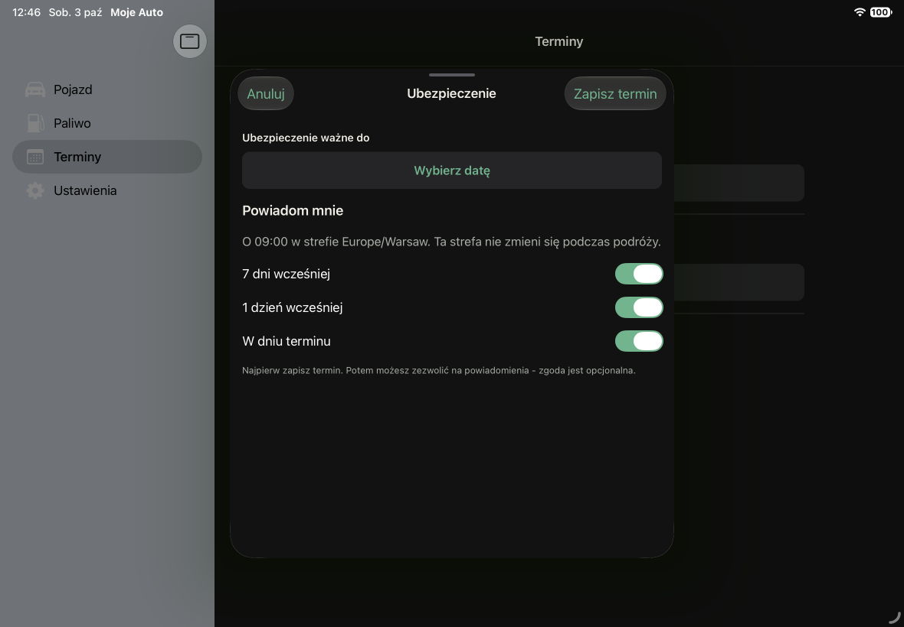

# Native UI and workspace performance

Implementation and verification record, 3 October 2026. This implements the 15-item audit
inspired by Moje Zegarki 0.8.2. Moje Auto retains its own version, 0.8.0, and its existing
dark product palette. Verification uses the separate `dev.mojeauto.qa` application.

## Implementation coverage

| Audit item                  | Result and main location                                                                                                                                                                               |
| --------------------------- | ------------------------------------------------------------------------------------------------------------------------------------------------------------------------------------------------------ |
| 1. Native navigation        | Expo Router NativeTabs: Vehicle, Fuel, Deadlines, Settings; native stacks for detail routes. Documents remain accessible from Vehicle. `apps/mobile/app/vehicle/` replaces the manual workspace shell. |
| 2. Modal editors            | iOS form sheets and Android modal routes, native header actions, shared dirty/busy removal guard. `components/layout/native-form-provider.tsx`.                                                        |
| 3. Platform controls        | SDK-compatible `@expo/ui` 58.0.11 and `expo-symbols` 58.0.3; segments, menu pickers and switches. Large text changes segments into menu selection. `components/ui/choice-field.tsx`.                   |
| 4. Compact forms            | Event/refuelling, odometer, cost and detail groups; compact iOS date/time controls; native inset handling; redundant back buttons removed from native routes.                                          |
| 5. Context menus            | SwiftUI menus on iOS and Compose dropdown menus on Android; separate destructive confirmation retained. `components/ui/action-menu.*.tsx`.                                                             |
| 6. Accessibility            | Native selected/checked states, informative list-row labels, selectable detail values, hidden inactive panes, large-text layout. Spoken screen-reader acceptance remains a release check below.        |
| 7. UTC                      | Explicit UTC field labels and formatted timestamps; date/time merging preserves UTC components across DST boundaries. `components/ui/utc-date-time.ts`.                                                |
| 8. Settings and status      | Grouped vehicle/units, app/system settings and privacy/data management; upcoming or overdue reminder on Vehicle.                                                                                       |
| 9. Tablets                  | iPad native adaptable sidebar; Android navigation rail; list/detail uses measured content width and font scale. Compact detail hides the primary pane. Editors remain mounted through rotation.        |
| 10. Tokens and motion       | Shared native palette with CSS parity test; redundant section-entry animations removed; existing accessibility material fallback retained. Native navigation owns transitions.                         |
| 11. Related data            | Attachment counts for loaded history IDs; minimal relation projections in bounded batches; debounced, paged SQL relation search with literal LIKE escaping.                                            |
| 12. Fuel                    | 50-row keyset pages plus independent complete consumption projection. Global consumption still includes records outside the visible page.                                                              |
| 13. Refresh                 | Successful history mutations update the cached record directly, preserving the original pagination boundary and scroll state. Serialized cache mutations remain serialized.                            |
| 14. Controllers             | Separate entry, fuel, document and vehicle draft/submit hooks; notification actions and presentation separated. Domain validation, monetary precision and file lifecycle remain intact.                |
| 15. Repeatable verification | Real-SQLite regression tests, deterministic host-query benchmark, native smoke protocol and measured limitations recorded below. Physical release performance acceptance is still open.                |

Paths in the table are relative to `apps/mobile` unless already prefixed with it.

Two additional regressions found during native testing were fixed:

- Android `react-native-screens` could update a toolbar after its screen detached, throwing
  `ScreenStackFragment added into a non-stack container` after saving. The existing
  `patches/react-native-screens@4.28.0.patch` now skips that final detached update. The existing
  SwiftPM patch is preserved. Dependencies were reapplied through NUB/SFW and Android rebuilt;
  repeated fuel and document saves returned successfully to their lists.
- Fast Refresh could leave application services bound to a closed database handle. A new
  database generation remounts dependent providers; a regression test verifies the new handle.

## Automated checks

- `nub run check`: passed, 70 suites / 471 tests, including lint, format, native module checks,
  TypeScript and migration checks.
- React Doctor 0.9.14: full scan 87/100, no errors, four warnings; changed scope 96/100,
  no errors, one warning. Full scan also covers newly created files.
- Remaining Doctor warnings are reviewed: NUB's ignored lockfile is not recognized; two
  sequential notification loops intentionally preserve cancellation/scheduling order; the
  reminder lookup checks only three fixed offsets. No suppression or toolchain downgrade.
- Expo Doctor 1.20.4: 18/20 checks passed. The two diagnostics concern the unrecognized
  `nub.lock` and the intentionally pinned TypeScript 7 versus Expo's expected TypeScript 6.
- Native iOS simulator and Android debug builds passed with the new native dependencies.

Important regression coverage includes tied-timestamp pagination, literal search metacharacters,
1,005 references across bind-variable batches, attachment counts, complete versus paged fuel
consumption, mutation across a history cursor, UTC merging, palette parity and database replacement.

## Native smoke evidence

| Target                         | Observed passes                                                                                                                                                             |
| ------------------------------ | --------------------------------------------------------------------------------------------------------------------------------------------------------------------------- |
| iPhone 18 Pro, iOS 27          | Native tabs, modal entry save, dirty cancel/keep editing, destructive confirmation cancel, settings, large-text menu selection, increased contrast.                         |
| iPhone 12, iOS 17.5            | First vehicle setup, native tabs, system segments/date controls, saving a 15 l refuelling and return to the fuel list.                                                      |
| iPad Air 11-inch M4, iPadOS 27 | Native sidebar, grouped settings, modal vehicle/reminder editors, rotation, reminder switches/date selection/save, system notification permission and updated status.       |
| Pixel 9 emulator               | Native forms, fuel save after the screens fix, PDF preview, relation search/selection and document metadata save with the selected relation preserved.                      |
| Pixel Tablet emulator          | Navigation rail, wide list/detail and compact detail, selected record across rotation, dirty draft across rotation, discard confirmation and return to the original record. |

The two Android emulators use the installed API 37 runtime. These are functional development-build
checks, not a release performance certification. The original Moje Zegarki 0.8.2 comparison on both
iPhones remains separate from the Moje Auto QA build. An isolated iPhone 18 Pro simulator was used
to avoid interfering with another session using the original reference simulator.

The iOS 27 automation backend marked visible sheet controls as covered in both applications.
Interactions used coordinates from fresh screenshots and verified resulting state; that diagnostic
alone is not evidence of a VoiceOver defect or proof of screen-reader correctness.





## Query benchmark

Run from the repository root:

```sh
nub --node scripts/benchmark-workspace.mjs > /tmp/workspace-benchmark.json
```

The script applies real migrations to host SQLite, creates 100/1,000/10,000 synthetic history,
document and fuel records, warms each query, then records 15 repetitions. History/document notes
contain 1,000 characters. Every document references a distinct history record, deliberately testing
the worst relation count. Relation batches contain at most 900 IDs plus the vehicle parameter,
below SQLite's conservative 999-variable limit. This replaced the first 200-ID implementation after
measurement showed excessive query overhead at 10,000 relations.

Both [first run](./benchmarks/workspace-2026-10-03.json) and
[repeat](./benchmarks/workspace-2026-10-03-repeat.json) are retained. Timings varied with host load;
the following exact payload sizes are more reliable than extrapolated mobile timings:

| 10,000-record scenario                    |                                  Before |                                                     After |
| ----------------------------------------- | --------------------------------------: | --------------------------------------------------------: |
| Attachments for the first 50 history rows | 12,770,001 bytes / 10,000 document rows |                                   2,251 bytes / 50 counts |
| All related entry labels                  |         14,430,001 bytes / full history |         1,670,001 bytes / minimal projections, 12 queries |
| Opening the relation selector             |                   Full history as above |                           8,518 bytes / 51 projected rows |
| Fuel list plus complete summary input     |                         4,137,774 bytes | 20,986-byte first page + 2,307,774-byte global projection |

The repeat measured median attachment-query time 10.125 → 0.736 ms and relation-read time
32.685 → 17.990 ms. Fuel queries totaled approximately 9.207 ms versus 10.371 ms before;
the main fuel benefit is bounded list materialization, not a claimed dramatic CPU improvement.
The script measures SQL execution and row transfer; serialized JSON size is a comparison metric,
not measured JS heap. It excludes native bridge costs, domain mapping, consumption calculation,
rendering and TTI. Documents themselves and the complete fuel summary remain linear in data size.
The history-mutation regression separately asserts that saving does not reread loaded history pages.

## Repeating native smoke tests

Use only a separate QA identifier and synthetic data. Build with `MOJE_AUTO_NATIVE_QA=1`, following
the [SDK 58 build instructions](./sdk58-migration.md). Keep the tested JS and native binaries aligned.

1. Create a vehicle with a 60 l tank. Visit every native tab, Documents and Settings. Return using
   native back gestures/buttons. Check list position after visiting a detail.
2. Add a repair, type a cost with the locale's decimal separator, open date/time controls, and save
   with the keyboard visible. Reopen, edit, try to dismiss, keep editing, then discard. Confirm the
   saved record is unchanged. Confirm deletion requires a second, destructive confirmation.
3. Add full/partial fuel records around a complete interval. Verify the list and global average;
   repeat with more than 50 records and load the next page.
4. Preview a synthetic PDF, edit its metadata, search for a related repair, select it and save.
   Reopen to confirm the association. Cancel file replacement without losing the original.
5. Add a deadline, toggle independent offsets, save, then exercise the optional system permission
   flow. Check the permission status and upcoming/overdue summary after returning to Vehicle.
6. Repeat on both phone platforms and both tablet platforms. Rotate while a draft is dirty and
   while a detail is selected. Narrow the actual app window where supported; do not substitute
   device size for measured content width.
7. Repeat with large text, Reduce Motion, Reduce Transparency and increased contrast. Traverse
   the form using VoiceOver/TalkBack and verify spoken values, selection, focus containment and
   focus restoration after menus. Inspect accessibility layout before adjusting text dimensions.

## Performance acceptance still to run on release builds

A bounded **debug Pixel Tablet** sample after `gfxinfo` reset recorded 57 rendered frames,
55 deadline misses (96.5%) in 75.809 s, with a reported 30 Hz display. Opening the editor and
typing a cost were included; host tests and other simulators were also active. The subsequent
[memory sample](./benchmarks/android-tablet-debug-memory-2026-10-03.json) reported 514,907 kB PSS.
This is poor frame health in that development environment. It does not demonstrate that the
release UI is smooth, nor isolate a code regression. No release FPS improvement is claimed.

To close performance acceptance, compare the pre-change snapshot and this implementation on the
same physical devices, release build configuration and synthetic datasets (100/1,000/10,000 rows).
Stop other emulators and development workloads; use the same refresh rate and thermal conditions.
Measure cold launch until the first interactive list, tab changes, a fixed scroll sequence,
cost typing, save after loading ten history pages, and a PDF near the supported size limit.
Record median/p95 startup and action times, frame deadlines and peak/settled memory. Use Android
Perfetto/Simpleperf or iOS Instruments for native CPU; use a separate profiling build with React
DevTools for commits. Do not mix profiling overhead with release frame timing.

For an Android QA frame window, reset immediately before the scenario:

```sh
adb -s <qa-serial> shell dumpsys gfxinfo dev.mojeauto.qa reset
# Perform the same scripted native scenario, without hot reloads or rebuilds.
agent-device perf frames --session <qa-session> --json
agent-device perf memory sample --session <qa-session> --json
```

`perf frames` resets its collection after reading. Command round-trip duration is not TTI.
This change does not claim physical release haptics, complete screen-reader speech testing,
all accessibility setting combinations, split-window testing or end-to-end release profiling.
